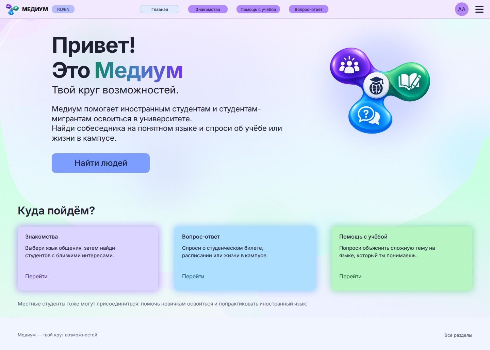

# Медиум — твой круг возможностей

Адаптивный frontend студенческой платформы по странице **«01 · Концепция»** проекта Figma. Реализованы все типы экранов из 17 макетов ПК и 31 мобильного состояния: главная, вход, регистрация, профиль, знакомства, вопросы, помощь с учёбой, рейтинг, сообщения и меню.



## Опубликованный сайт

[Открыть Медиум](https://medium-bob01.amvera.io/) — сайт развёрнут в Amvera через Safari, работает по HTTPS.

## Запуск

Нужен Node.js 20 или новее. Команды выполняются в папке проекта:

```sh
npm ci
npm run dev
```

Открыть **http://127.0.0.1:5173/**. Для сборки и проверки готовой версии:

```sh
npm run build
npm run preview
```

`dist/` содержит статический сайт. Его нужно открывать через HTTP-сервер, а не двойным щелчком по `index.html`. Маршруты используют `#`, поэтому работают и на статическом хостинге, в том числе в подпапке проекта.

## Быстрая демонстрация

1. Открыть **Вход → Демо-пользователь → Алина Ахметова → Открыть демоверсию**.
2. В **Знакомствах** выбрать язык или интерес, открыть студента и нажать **Написать**.
3. В **Вопрос-ответе** открыть вопрос о студенческом билете и оценить ответ от 1 до 5 звёзд.
4. Посмотреть **Рейтинг**. Изменение оценки заменяет старую; звёзды не прибавляются повторно.
5. В **Помощи с учёбой → Нужна помощь** опубликовать запрос. Демо-пользователь Вэй может откликнуться через **Могу помочь**. Вернуться к автору, выбрать помощника и нажать **Помощь получена**, затем поставить оценку.

Можно создать отдельный учебный аккаунт и заполнить профиль. Демо-персонажи, вопросы и сообщения вымышлены.

## Страницы

| Адрес | Что работает |
| --- | --- |
| `#/` | Главная и переходы в разделы |
| `#/login`, `#/register` | Вход, регистрация, ошибки формы, показ пароля, деморежим |
| `#/profile` | Сохранение имени, направления, курса, языков, интересов и описания |
| `#/people`, `#/people/wei` | Поиск, фильтры, общие языки, карточки, профиль студента |
| `#/questions`, `#/questions/q1` | Публикация, фильтры, ответы и оценки |
| `#/questions?tab=rating` | Общий рейтинг, сумма звёзд, число оценок, среднее |
| `#/study` | Открытые запросы, поиск предмета, отклики |
| `#/study?tab=need` | Публикация запроса, выбор помощника, завершение, оценка |
| `#/chats`, `#/chats/c1` | Диалоги, сообщения, сохранение переписки |
| `#/menu` | Все разделы, смена RU/EN и выход |

На телефоне карточки располагаются в одну колонку, используется нижняя навигация, список диалогов и переписка открываются отдельно, рейтинг доступен отдельной вкладкой. Сохранены исходный фон, логотип, фиолетовые, голубые и мятные акценты, светлые карточки и скругления. Текст на пастельных кнопках темнее для читаемости.

## Рейтинг

**Рейтинг = сумма оценок за ответы + сумма оценок за завершённую помощь.** Каждая оценка — целое число от 1 до 5. Ставить её может только автор вопроса или запроса. Собственный ответ оценить нельзя. Повторный выбор заменяет предыдущую оценку; число оценок не увеличивается. При равенстве суммы сначала сравнивается число оценок, затем имя.

## Данные и границы frontend

Профили, вопросы, ответы, оценки и сообщения хранятся в `localStorage` текущего браузера. Состояние синхронизируется между вкладками одного браузера и одного адреса сайта. Очистка данных сайта сбрасывает изменения. `localhost` и `127.0.0.1` имеют разные хранилища.

Это учебный frontend. Реальная переписка между разными людьми и устройствами, защищённая серверная авторизация, модерация и база данных требуют backend. Локальная регистрация хранит соль и PBKDF2-хеш вместо открытого пароля, но не является защищённой серверной авторизацией. Для регистрации нужен HTTPS либо `localhost`/`127.0.0.1`, где доступен Web Crypto. Для демонстрации используй учебный пароль.

RU/EN переводит интерфейс; пользовательские тексты и названия предметов остаются на языке ввода.

## Проверки

```sh
npm test
npm run test:install
npm run test:e2e
```

7 тестов правил приложения прошли. Сборка прошла. Проверены пользовательские сценарии в браузере Codex, размеры 1440, 768, 390 и 320 пикселей, клавиатурный выбор звёзд и автоматическая доступность через axe. Результаты и ограничения — в [отчёте](docs/REPORT.md).

Все **14 end-to-end тестов в Chromium и Firefox прошли в GitHub Actions** вместе с 7 тестами логики и production-сборкой. Проверены 112 сочетаний маршрута и ширины, клавиатура, формы, чат, оценки и 44 автоматические проверки доступности. [Успешный запуск CI](https://github.com/JustEd10/medium-student-community/actions/runs/37578609787) проверил код коммита `0bd2ec9`. В локальной среде macOS отдельные процессы браузеров были заблокированы; кроссбраузерная проверка выполнена на Ubuntu в CI. Workflow использует официальные [checkout](https://github.com/actions/checkout), [setup-node](https://github.com/actions/setup-node) и [upload-artifact](https://github.com/actions/upload-artifact).

В режиме разработки доступны инструменты проверки:

- `http://127.0.0.1:5173/scripts/preview.html` — экран заданной ширины и проверка axe;
- `http://127.0.0.1:5173/scripts/capture.html?width=390&height=844&route=%2F` — чистый мобильный экран для скриншота.

Они не входят в production-сборку.

## Материалы для сдачи

- [Короткий отчёт](docs/REPORT.md)
- [Определения из задания](docs/GLOSSARY.md)
- [Соответствие экранов Figma и сайта](docs/SCREEN-MAP.md)
- [Скриншоты ПК и телефона](docs/screenshots/README.md)

Репозиторий: [JustEd10/medium-student-community](https://github.com/JustEd10/medium-student-community). Репозиторий публичный и доступен без входа в аккаунт. Исходники, тесты, отчёт и скриншоты находятся в ветке `main`.
