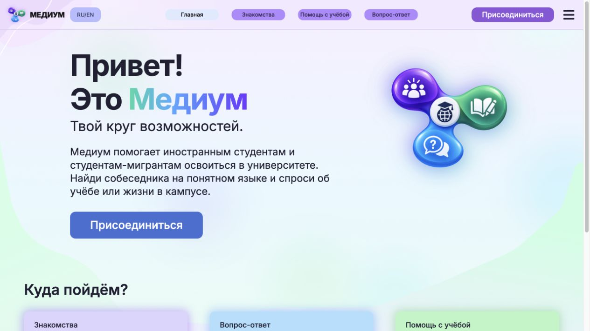
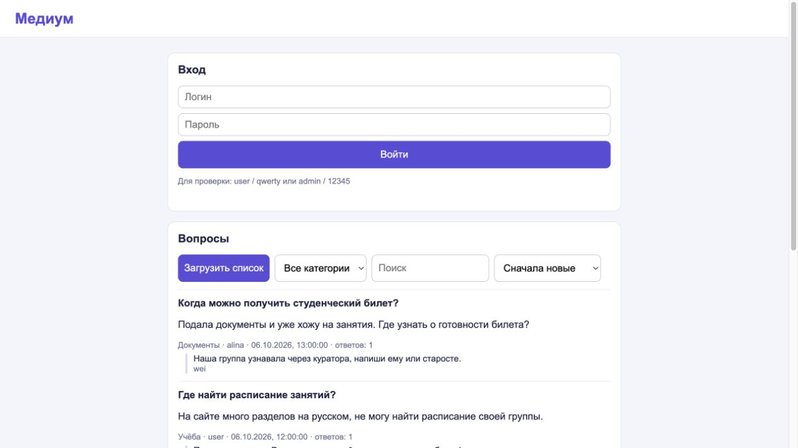

# Публикация Медиума — 10.10.2026

Исправленный основной сайт и учебная страница опубликованы на Amvera. Сервер работает на Node.js 24 и Express; сайт и API обслуживаются одним процессом. Исходники и 36 обновлённых снимков ПК и телефона находятся в GitHub.

- [Основной сайт](https://medium-bob01.amvera.io/).
- [Учебная страница задания](https://medium-bob01.amvera.io/app/).
- [Исходники опубликованной версии](https://github.com/JustEd10/medium-student-community/commit/c5f8f390bf9c1b2f976f861ff94085a9232021c9).
- [Успешная проверка GitHub Actions](https://github.com/JustEd10/medium-student-community/actions/runs/38058977236): 19 тестов и сборка.

## Проверка на хостинге

Проверено 10.10.2026 в 17:48 по Москве. `/`, `/hello`, `/api/app/state` и `/app/` возвращают 200. Демо-вход Алины, получение состояния и выход выполняются через API; после выхода токен больше не даёт доступа к профилю и переписке. У гостя нет личных чатов, ответы API имеют `Cache-Control: no-store`.

В браузере загружена новая сборка `index-Bbig7VSw.js` и `index-CPJ2EkuY.css`. Учебная страница загружает вопросы и демонстрационный массив с сервера. Запись `db.json` появилась в постоянном разделе Data Amvera после проверки входа и выхода. Учебные массивы остаются в памяти, как требует задание.

[Результаты запросов без токенов](deployment/live-checks.json).

## Развёртывание

Загружены `Dockerfile` и `source.tar.gz` через Safari в существующий проект Amvera. Конфигурация использует порт 80, постоянный каталог `/data` и одну требуемую реплику. Тариф и автоскейлинг не менялись.

Первая сборка завершилась с кодом 0, но платформа не перешла к запуску. После заморозки и повторной сборки приложение запустилось. SHA-256 опубликованного образа: `c7248c9b97036d8905c8dfdcea47c90c8ee2d692d9ebbeb524599297dd4c6f7b`.

Снимки опубликованной версии:

